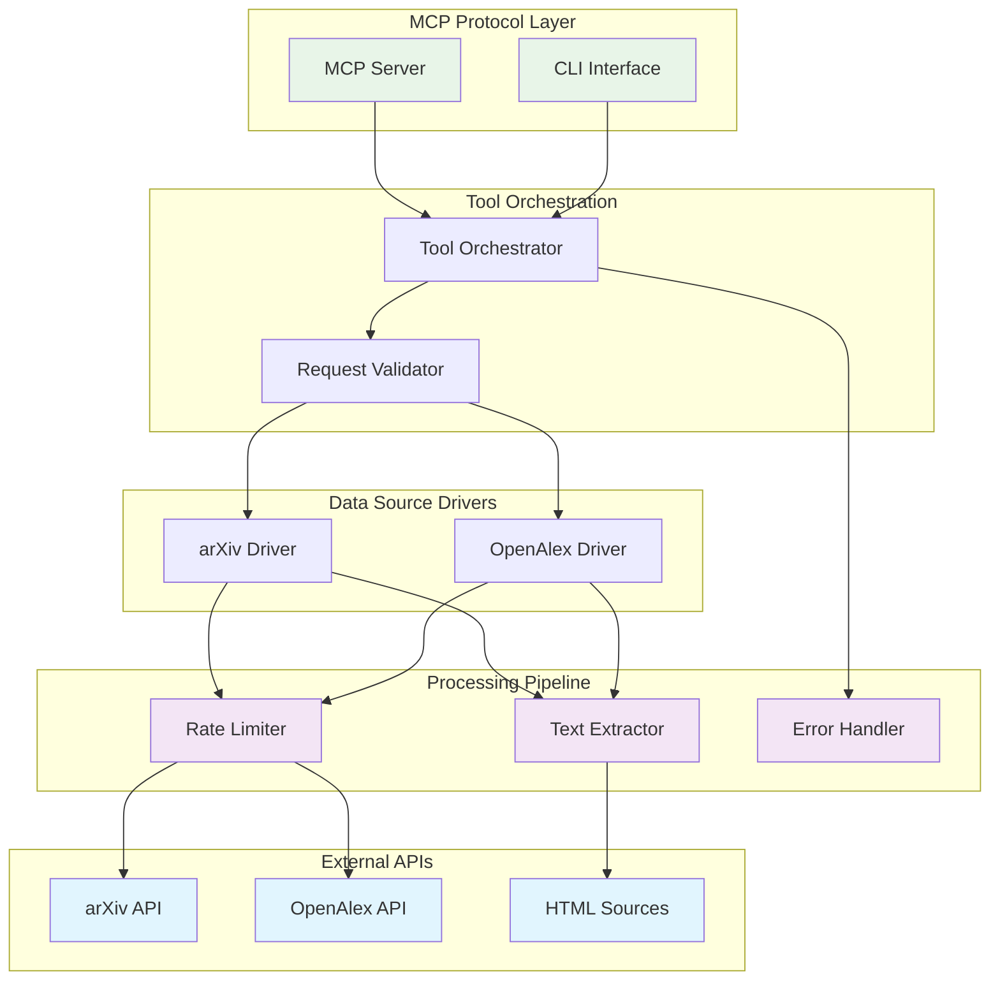
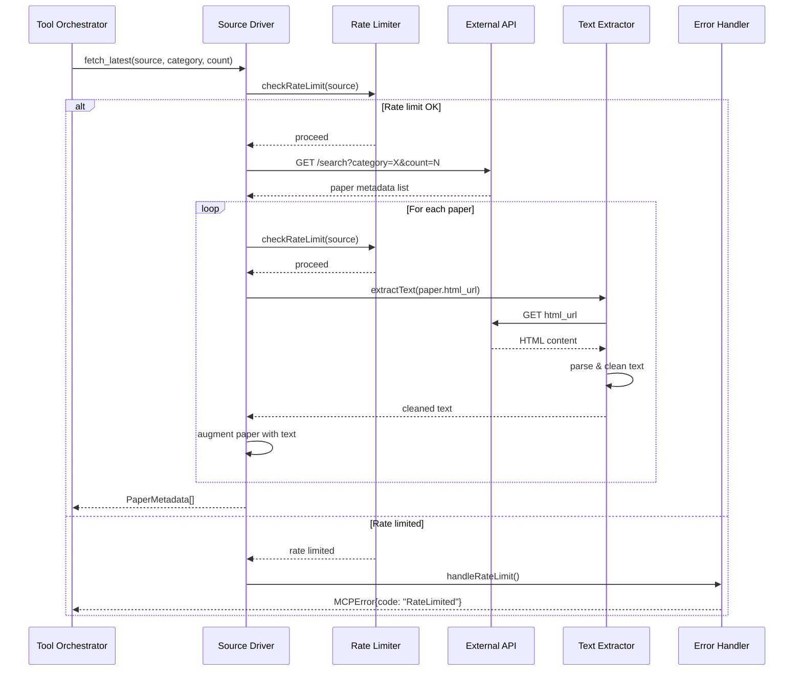
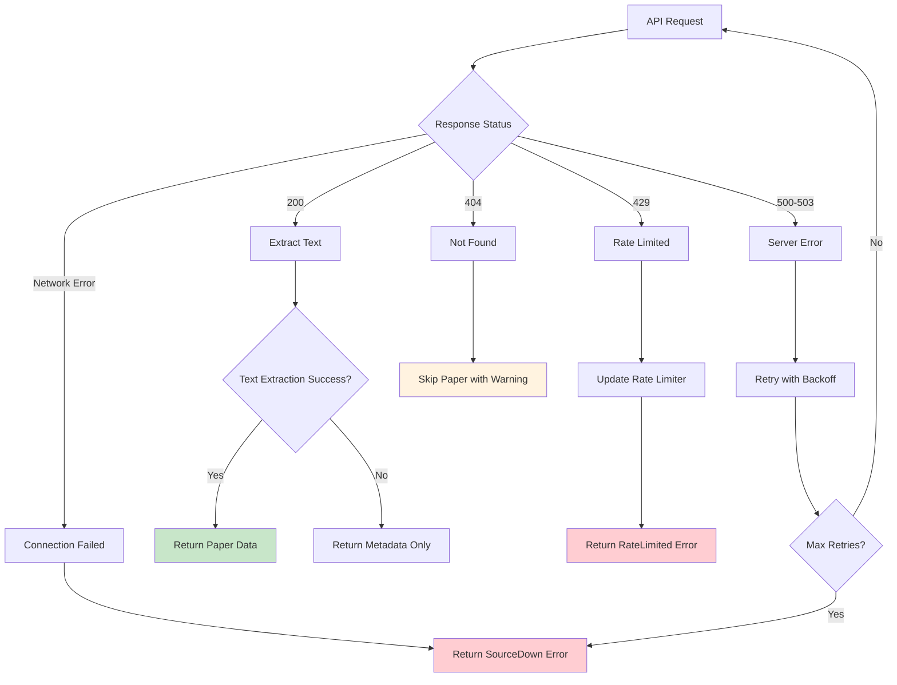

# Architecture for MCP Server – Scientific‑Paper Harvester & Text‑Search

Status: Draft

## Technical Summary

This architecture defines a Node.js-based Model Context Protocol (MCP) server that provides LLMs with real-time access to scientific papers from arXiv and OpenAlex. The system follows a streaming, stateless design with per-source rate limiting and robust error handling. Built as an ESM package targeting Node.js 20 LTS, it exposes four core tools through the MCP protocol while maintaining a CLI interface for testing and offline usage.

The architecture emphasizes simplicity for the MVP with clean separation between data source drivers, text extraction pipelines, and MCP protocol handling. Rate limiting is implemented per data source per session, ensuring respectful API usage while maintaining responsive performance for LLM interactions.

## Technology Table

| Technology | Version | Description |
| ---------- | ------- | ----------- |
| Node.js | 20 LTS | Runtime environment with ESM support |
| @modelcontextprotocol/sdk | ^1.0.0 | Official MCP server framework and transport |
| TypeScript | ^5.0.0 | Type safety and development experience |
| Zod | ^3.22.0 | Runtime schema validation for MCP tools |
| axios | ^1.6.0 | HTTP client with retry and timeout support |
| cheerio | ^1.0.0 | Server-side HTML parsing for text extraction |
| winston | ^3.11.0 | Structured logging with multiple levels |
| vitest | ^1.0.0 | Fast unit testing framework |
| nock | ^13.0.0 | HTTP mocking for offline testing |
| execa | ^8.0.0 | CLI testing with subprocess execution |

## High-Level Overview

The system follows a **Service-Oriented Architecture** within a single Node.js process, structured as a pipeline of specialized services. This approach balances simplicity for the MVP while providing clear separation of concerns for future extensibility.

### Component View



## Architectural Diagrams, Data Models, Schemas

### MCP Tool Interface Schema

```typescript
// Tool Response Schema
interface PaperMetadata {
  id: string;
  title: string;
  authors: string[];
  date: string;  // ISO format
  pdf_url?: string;
  text: string;
}

interface ToolResponse {
  content: PaperMetadata[] | CategoryList | PaperMetadata;
  warnings?: string[];
  errors?: string[];
}

// Error Response Schema
interface MCPError {
  code: 'NotAvailable' | 'PartialSuccess' | 'RateLimited' | 'SourceDown' | 'InvalidQuery';
  message: string;
  suggestions?: string[];
  retryAfter?: number; // seconds
}
```

### Rate Limiter State Schema

```typescript
interface RateLimiterState {
  [source: string]: {
    tokens: number;
    lastRefill: number;
    maxTokens: number;
    refillRate: number; // tokens per second
  }
}

// Per session state
interface SessionState {
  rateLimiters: RateLimiterState;
  startTime: number;
}
```

### Data Source Response Mapping

```typescript
// arXiv Entry to Internal Format
interface ArxivEntry {
  id: string;           // "2401.12345"
  title: string;
  authors: Author[];
  published: string;
  pdf_url: string;
  html_url?: string;
}

// OpenAlex Work to Internal Format  
interface OpenAlexWork {
  id: string;           // "W2741809807"
  title: string;
  authorships: Authorship[];
  publication_date: string;
  primary_location: {
    landing_page_url?: string;
    pdf_url?: string;
    source_type: string;
  }
}
```

### Text Extraction Pipeline Flow



### Error Handling Decision Tree



## Project Structure

```
latest-science-mcp/
├── src/
│   ├── server.ts              # MCP server entry point
│   ├── cli.ts                 # CLI interface entry point
│   ├── tools/                 # MCP tool implementations
│   │   ├── fetch-latest.ts
│   │   ├── fetch-top-cited.ts
│   │   ├── list-categories.ts
│   │   └── fetch-content.ts
│   ├── drivers/               # Data source drivers
│   │   ├── base-driver.ts     # Abstract base class
│   │   ├── arxiv-driver.ts    # arXiv API integration
│   │   └── openalex-driver.ts # OpenAlex API integration
│   ├── extractors/            # Text extraction pipeline
│   │   ├── base-extractor.ts  # Abstract extractor
│   │   ├── html-extractor.ts  # HTML parsing & cleaning
│   │   └── text-cleaner.ts    # Text normalization
│   ├── core/                  # Core services
│   │   ├── rate-limiter.ts    # Per-source rate limiting
│   │   ├── error-handler.ts   # Structured error responses
│   │   ├── validator.ts       # Request validation
│   │   └── logger.ts          # Structured logging
│   ├── types/                 # TypeScript definitions
│   │   ├── mcp.ts            # MCP-specific types
│   │   ├── papers.ts         # Paper metadata types
│   │   └── sources.ts        # Data source types
│   └── config/                # Configuration
│       ├── constants.ts       # API endpoints, defaults
│       └── schemas.ts         # Zod validation schemas
├── tests/                     # Test suites
│   ├── unit/                  # Unit tests with mocks
│   ├── integration/           # CLI integration tests
│   ├── mcp/                   # MCP protocol tests
│   └── __fixtures__/          # Test data and mocks
│       ├── arxiv-responses/
│       ├── openalex-responses/
│       └── html-samples/
├── docs/                      # Documentation
│   ├── api.md                 # MCP tool documentation
│   ├── cli.md                 # CLI usage guide
│   └── examples/              # Usage examples
├── package.json               # Package configuration
├── tsconfig.json             # TypeScript configuration
├── vitest.config.ts          # Test configuration
└── README.md                 # Project overview
```

## Testing Requirements and Framework

### Test Strategy by Layer

| Test Type | Framework | Coverage Goal | Mock Strategy |
|-----------|-----------|---------------|---------------|
| Unit Tests | Vitest | >90% line coverage | nock for HTTP, in-memory mocks for services |
| Integration | Vitest + execa | All CLI commands | nock fixtures, real MCP protocol |
| MCP Contract | Custom harness | All tool schemas | Stdio transport testing |
| E2E | GitHub Actions | Happy path only | Blocked external network |

### Test Data Management

```typescript
// Fixture structure
interface TestFixture {
  arxiv: {
    searchResponse: ArxivSearchResponse;
    paperHtml: string;
    expectedText: string;
  };
  openalex: {
    worksResponse: OpenAlexWorksResponse;
    paperHtml: string;
    expectedText: string;
  };
}
```

## Patterns and Standards

### Architectural Patterns

- **Repository Pattern**: Each data source driver implements a common interface (`BaseDriver`) for consistent tool orchestration
- **Strategy Pattern**: Text extraction varies by source type (HTML vs future PDF support)
- **Factory Pattern**: Driver instantiation based on source parameter
- **Chain of Responsibility**: Error handling pipeline with source-specific handlers

### API Design Standards

- **Protocol**: MCP 1.0 with stdio transport
- **Validation**: All tool parameters validated with Zod schemas before processing
- **Error Format**: Structured MCPError objects with actionable suggestions
- **Response Size**: Maximum 8MB payload with automatic truncation warnings

### Coding Standards

- **Style Guide**: Standard TypeScript with ESLint + Prettier
- **Naming Conventions**: 
  - Files: kebab-case (`fetch-latest.ts`)
  - Classes: PascalCase (`ArxivDriver`)
  - Functions/variables: camelCase (`fetchContent`)
  - Constants: SCREAMING_SNAKE_CASE (`MAX_PAPERS_PER_REQUEST`)
- **Import Strategy**: Barrel exports from each module directory
- **Documentation**: JSDoc for all public methods and interfaces

### Error Handling Strategy

```typescript
// Standardized error creation
class MCPErrorBuilder {
  static notAvailable(source: string, id: string): MCPError {
    return {
      code: 'NotAvailable',
      message: `Paper ${id} from ${source} is not accessible`,
      suggestions: [
        'Try searching for a different paper',
        'Check if the paper ID is correct',
        'Use fetch_latest to find accessible papers'
      ]
    };
  }
  
  static partialSuccess(successCount: number, totalCount: number): MCPError {
    return {
      code: 'PartialSuccess',
      message: `Retrieved ${successCount}/${totalCount} papers successfully`,
      suggestions: successCount === 0 ? [
        'Try a different category or time range',
        'Check if the source is currently available'
      ] : []
    };
  }
}
```

### Logging Standards

```typescript
// Winston configuration
const logger = winston.createLogger({
  level: 'info',
  format: winston.format.combine(
    winston.format.timestamp(),
    winston.format.errors({ stack: true }),
    winston.format.json()
  ),
  defaultMeta: { service: 'latest-science-mcp' },
  transports: [
    new winston.transports.Console({
      format: winston.format.simple()
    })
  ]
});

// Usage patterns
logger.info('MCP tool called', { tool: 'fetch_latest', source: 'arxiv', category: 'cs.AI' });
logger.warn('Rate limit approaching', { source: 'arxiv', remainingTokens: 2 });
logger.error('Text extraction failed', { source: 'openalex', paperId: 'W123', error: error.message });
```

## Initial Project Setup (Manual Steps)

### Story 0: Project Initialization

1. **Repository Setup**:
   ```bash
   mkdir latest-science-mcp
   cd latest-science-mcp
   npm init -y
   git init
   ```

2. **Package Configuration**:
   ```bash
   # Update package.json with proper metadata
   npm pkg set name="@futurelab/latest-science-mcp"
   npm pkg set type="module"
   npm pkg set main="dist/server.js"
   npm pkg set bin.latest-science-mcp="dist/cli.js"
   ```

3. **Core Dependencies**:
   ```bash
   npm install @modelcontextprotocol/sdk zod axios cheerio winston
   npm install -D typescript @types/node vitest nock execa eslint prettier
   ```

4. **TypeScript Configuration**:
   - Create `tsconfig.json` with ES2022 target, ESM modules
   - Enable strict mode and path mapping for clean imports

5. **Environment Setup**:
   - No external accounts required for MVP
   - All API endpoints are public and open access
   - Rate limiting handles respectful usage automatically

## Infrastructure and Deployment

### MVP Deployment Strategy

- **Target Environment**: npm registry for global installation
- **Runtime**: Node.js 20 LTS (user-provided)
- **Distribution**: Pre-compiled TypeScript to JavaScript ESM
- **Installation**: Single command `npx @futurelab/latest-science-mcp`

### CI/CD Pipeline

```yaml
# GitHub Actions workflow
name: Test and Publish
on: [push, pull_request]
jobs:
  test:
    runs-on: ubuntu-latest
    steps:
      - uses: actions/checkout@v4
      - uses: actions/setup-node@v4
        with:
          node-version: '20'
      - run: npm ci
      - run: npm test
      - run: npm run build
  
  publish:
    if: startsWith(github.ref, 'refs/tags/v')
    needs: test
    runs-on: ubuntu-latest
    steps:
      - uses: actions/checkout@v4
      - uses: actions/setup-node@v4
        with:
          node-version: '20'
          registry-url: 'https://registry.npmjs.org'
      - run: npm ci
      - run: npm run build
      - run: npm publish
        env:
          NODE_AUTH_TOKEN: ${{ secrets.NPM_TOKEN }}
```

### Resource Requirements

- **Memory**: ~50MB base + ~10MB per concurrent operation
- **Network**: Outbound HTTPS to arxiv.org and api.openalex.org
- **Storage**: No persistent storage required for MVP
- **Dependencies**: Node.js 20+ runtime environment only

## Change Log

| Date | Version | Changes | Author |
|------|---------|---------|---------|
| 2025-01-XX | 0.1.0 | Initial architecture draft | R&D | 